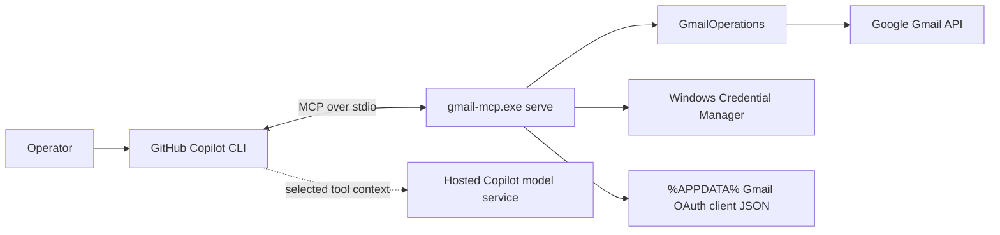

# Architecture

## Overview

Gmail MCP is a Python 3.12 stdio MCP server. GitHub Copilot CLI launches the
installed console entry point on demand and exchanges JSON-RPC messages over
stdin/stdout.



This is a local MCP integration, not a Copilot plugin. The user-level MCP
configuration points directly at:

```text
<cloned-repository>\.venv\Scripts\gmail-mcp.exe serve
```

## Components

| Module | Responsibility |
| --- | --- |
| `cli.py` | `configure-client`, `auth`, `status`, `revoke`, and `serve` commands |
| `auth.py` | Installed-app OAuth browser flow, profile verification, local client JSON generation |
| `credential_store.py` | Versioned refresh-token record in WinVault |
| `gmail_client.py` | Credential reconstruction, refresh, TLS, timeouts, retries, Gmail service creation |
| `message_parser.py` | MIME traversal, header decoding, HTML-to-text fallback, attachment metadata |
| `operations.py` | Gmail API operations, limits, validation, confirmations, rollback |
| `server.py` | MCP registration, tool annotations, structured output, async thread offload |

## Authentication flow

1. The operator creates or downloads a Google Desktop OAuth client.
2. `%APPDATA%\gmail-mcp\credentials.json` stores the client ID and, when
   required, client secret. This file is not a user access token.
3. `gmail-mcp auth` opens a loopback browser flow with PKCE, offline access, and
   explicit consent.
4. The server verifies that `gmail.modify` was granted, records the actual
   granted scope set, and calls
   `users.getProfile` to identify the mailbox.
5. Only the durable refresh token, mailbox identity, granted scopes, and record
   version are saved to WinVault.
6. Access tokens are minted in memory when a tool needs Gmail.

## Tool-call flow

1. FastMCP validates the input schema.
2. The async handler offloads the synchronous Google client through
   `anyio.to_thread.run_sync`.
3. `GmailClientFactory` re-reads WinVault before using cached credentials.
4. Changed or missing credential state clears the cache and fails closed.
5. The operation validates limits and IDs, calls Gmail, and returns bounded
   structured data.
6. Expected errors become MCP `ToolError` results rather than server crashes.

## Concurrency

Each Copilot session can start its own stdio process. Server processes share the
WinVault record but do not share memory. Credential reads are frequent and
writes are limited to auth, revoke, and rare refresh-token rotation.

Within one server process, an `RLock` protects the shared Google service and
credential cache. Blocking HTTP calls run outside the MCP event loop.

## Revocation behavior

Every tool call checks the current WinVault record. Deleting or replacing the
record invalidates cached credentials for subsequent calls in all server
instances. In-flight requests cannot be cancelled, and an issued access token
may remain valid briefly at Google.

## Data locations

| Data | Persistent | Repository |
| --- | --- | --- |
| Source, tests, documentation | Yes | Yes |
| Virtual environment | Yes | Ignored |
| OAuth client JSON | Yes | No |
| Refresh token | Yes, WinVault | No |
| Access token | No | No |
| Email content | No application persistence unless an operator explicitly downloads one attachment | No |
| Downloaded attachment | Yes, in the operator-selected existing directory | No |
| Copilot MCP path/tool allowlist | Yes, user config | No |

## Scope and API behavior

`gmail.modify` enables read/search, drafts, sending, labels, archive, Trash, and
untrash. `gmail.settings.basic` enables filter create/delete. Neither authorizes
immediate permanent deletion.

Full-mailbox search sets `includeSpamTrash=true` by default. Generic label
mutation cannot add or remove `TRASH` or `SPAM`.
